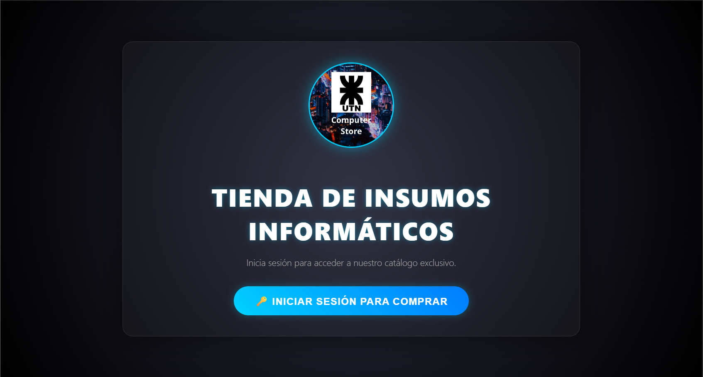
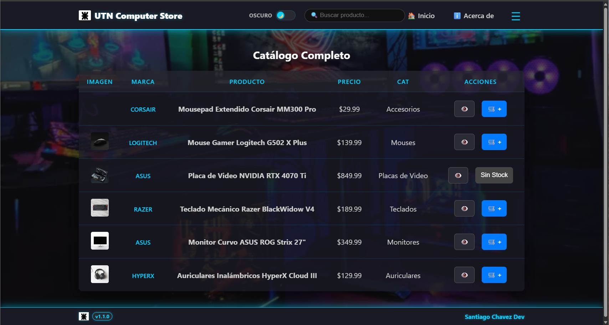
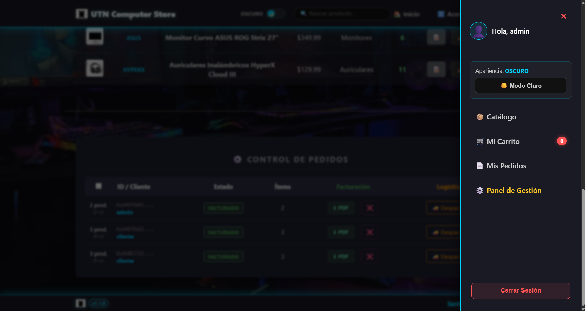
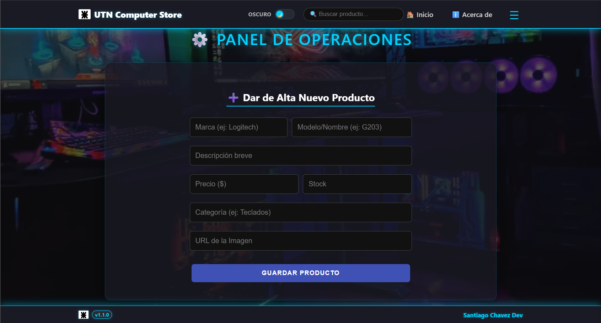
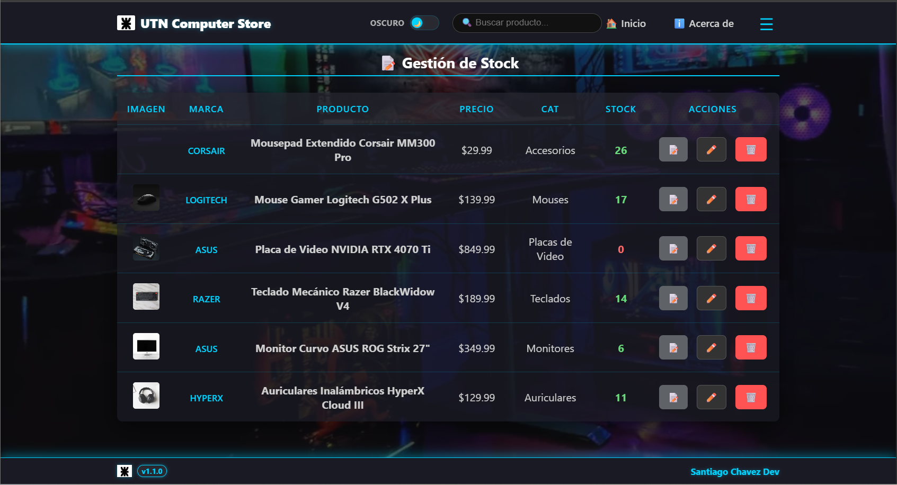
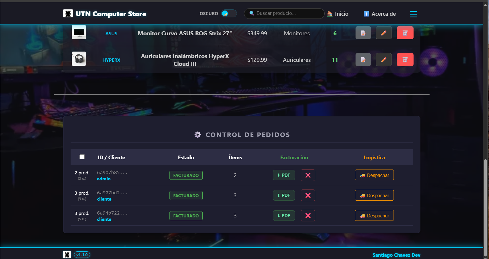
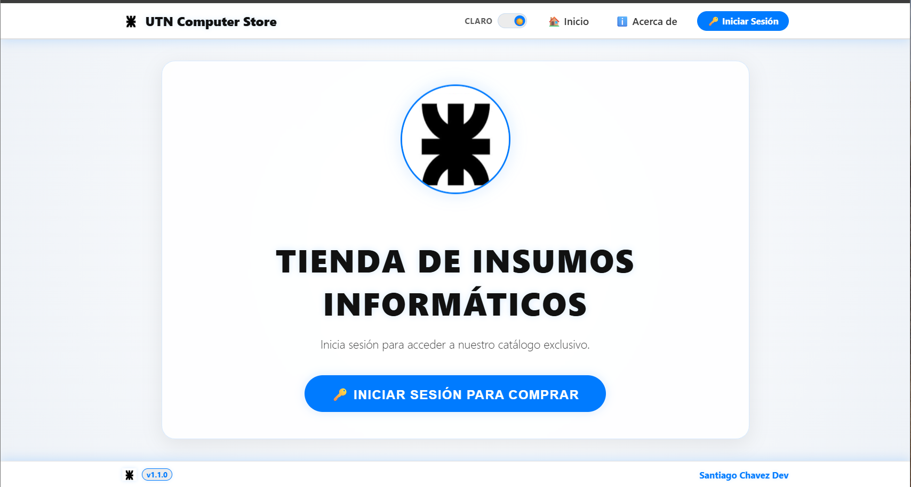
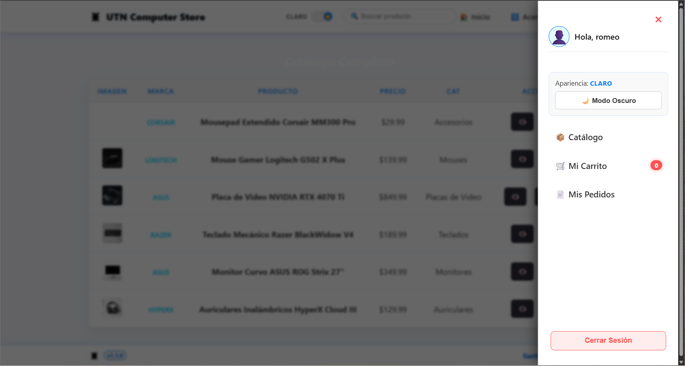

<p align="center">
  
</p>

# Trabajo Integrador Final - E-Commerce Fullstack
### Tienda de Insumos Informáticos - UTN Avellaneda


Este proyecto es una aplicación web Fullstack de E-commerce diseñada para una Tienda de Insumos Informáticos. Ofrece una solución integral que abarca desde el catálogo público y carrito de compras para clientes, hasta un panel de administración avanzado (Backoffice) con gestión de stock, control de pedidos, facturación PDF y logística.

Este software fue desarrollado y presentado como el **Trabajo Integrador Final** para aprobar la cursada de la **Tecnicatura Universitaria en Programación** en la **Universidad Tecnológica Nacional (UTN) Facultad Regional Avellaneda**.

---

## 👤 Información del Autor y Académica

* **Autor:** Chavez Santiago Ezequiel
* **Institución:** Universidad Tecnológica Nacional (UTN) - Facultad Regional Avellaneda
* **Carrera:** Tecnicatura Universitaria en Programación
* **Propósito:** Trabajo Integrador Final de Cátedra

---

## 🛠️ Tecnologías Utilizadas

### Backend (API REST)
*  **Java 17+**: Lenguaje de programación base.
*  **Spring Boot 3.x**: Framework principal para el backend y API REST.
*  **Spring Data MongoDB**: Mapeo y persistencia de datos NoSQL.
*  **MongoDB Atlas**: Base de datos NoSQL alojada en la nube.
*  **Maven**: Gestión de dependencias y empaquetado del software.

### Frontend (SPA)
*  **React 18**: Librería declarativa para interfaces de usuario.
*  **Vite**: Servidor de desarrollo y empaquetador ultrarrápido.
*  **React Router v6**: Enrutamiento dinámico SPA y rutas protegidas.
*  **CSS3 Moderno**: Estilos personalizados, diseño "Dark Neon", glassmorphism y micro-animaciones.
* 📄 **jsPDF & AutoTable**: Generación dinámica y descarga de comprobantes en PDF.

---

## 📸 Galería y Recorrido Visual de la Aplicación

A continuación se presentan las principales pantallas, módulos de administración y flujos funcionales de **UTN Computer Store**:

### 1. 🌌 Portada de Acceso y Bienvenida (`Inicio / Autenticación`)

- **Diseño Inmersivo Dark Neon:** Interfaz moderna con efectos de resplandor neón, tipografía estilizada y diseño centrado en el usuario.
- **Acceso Seguro al Catálogo:** Puerta de entrada a la plataforma que guía al usuario a identificarse antes de iniciar su recorrido de compras.
- **Identidad de Marca:** Estética tecnológica personalizada para la tienda de insumos informáticos de UTN Avellaneda.

---

### 2. 🛍️ Catálogo Público y Experiencia de Compra (`Catálogo / Productos`)

- **Exploración de Hardware y Periféricos:** Visualización clara de productos de primeras marcas (Corsair, Logitech, ASUS, Razer, HyperX) con imagen, marca, categoría y precio.
- **Gestión Automatizada de Stock:** Botón interactivo de añadir al carrito habilitado para productos en inventario y badge automático **"Sin Stock"** con bloqueo de compra cuando el stock llega a cero.
- **Búsqueda y Navegación Rápida:** Barra de búsqueda en tiempo real integrada en el encabezado y acceso directo a la vista detallada de cada ítem.

---

### 3. 📱 Menú Lateral y Perfil de Usuario (`Drawer de Navegación`)

- **Gestión de Sesión:** Saludo personalizado al usuario autenticado y opción de cierre de sesión seguro en un solo clic.
- **Navegación Intuitiva:** Enlaces directos a Catálogo, Mis Pedidos y Carrito de Compras con badge reactivo que indica la cantidad de ítems seleccionados en tiempo real.
- **Permisos por Rol:** Acceso condicional exclusivo al **Panel de Gestión** visible únicamente para usuarios con permisos de administrador (`ADMIN`).

---

### 4. ⚙️ Panel de Operaciones - Alta de Productos (`Backoffice / Gestión`)

- **Formulario Integral de Carga:** Alta ágil de nuevos artículos con especificación de marca, modelo, descripción, precio unitario y stock inicial.
- **Clasificación Dinámica:** Asignación inmediata por categorías (Teclados, Mouses, Monitores, Placas de Video, Accesorios) y vinculación de imágenes mediante URL directa.
- **Persistencia en Base de Datos:** Registro instantáneo y sincronizado con MongoDB Atlas mediante la API REST de Spring Boot.

---

### 5. 📊 Gestión Integral de Inventario (`Backoffice / Stock`)

- **Semáforo Visual de Inventario:** Columna de stock destacada con código visual numérico (verde para stock disponible y alerta roja en `0` para productos agotados).
- **Acciones de Mantenimiento:** Herramientas de administración rápida para consultar ficha técnica, modificar parámetros de producto (lápiz) o eliminar ítems (papelera).
- **Consistencia Inmediata:** Cualquier modificación en el inventario impacta en tiempo real sobre la disponibilidad en el catálogo del cliente.

---

### 6. 🚚 Control de Pedidos, Facturación PDF y Logística (`Backoffice / Pedidos`)

- **Trazabilidad Completa de Compras:** Monitoreo cronológico de órdenes con identificador único de compra, usuario comprador y desglose de cantidad de unidades.
- **Facturación Automática con jsPDF:** Emisión y descarga en un clic de la factura formal en PDF con cálculo de subtotales, totales y membrete institucional.
- **Logística y Flujo de Entrega:** Control de estados de pedidos (`FACTURADO`, `PENDIENTE`), botón de despacho (`🚚 Despachar`) y opción de anulación o cancelación de pedidos.

---

### 7. ☀️ Soporte Dual-Theme: Modo Claro (`Light Mode / Accesibilidad`)


- **Conmutación Dinámica (Theme Toggle):** Switch accesible desde el Navbar y desde el menú lateral para alternar al instante entre Modo Oscuro y Modo Claro.
- **Adaptación Visual Limpia:** Paleta cromática optimizada para entornos luminosos con fondos claros, manteniendo el contraste y la jerarquía de lectura.
- **Persistencia de Preferencia:** La elección del tema se preserva de manera global y reactiva a través del `ThemeContext`.

---

## 🚀 Instalación y Ejecución

### Requisitos Previos
* **Java JDK 17** o superior instalado y configurado en las variables de entorno.
* **Node.js (LTS)** instalado.
* Conexión a Internet (para conectar a la base de datos de MongoDB Atlas en la nube).

### Método de Arranque Rápido (Recomendado para Windows)
El proyecto incluye scripts preparados para levantar automáticamente tanto la base de datos, el backend como el frontend con un solo clic:

1. Haz doble clic sobre el archivo [`lanzarProyecto.vbs`](file:///c:/Users/Santiago/Proyectos%20integradores/ecommerce%20gamer/lanzarProyecto.vbs).
2. Se abrirá un cuadro de diálogo informando el arranque y, tras unos segundos, se abrirá automáticamente tu navegador en `http://localhost:5176` con la aplicación lista para usar.
3. *Alternativamente*, puedes ejecutar el archivo [`start_proyecto.bat`](file:///c:/Users/Santiago/Proyectos%20integradores/ecommerce%20gamer/start_proyecto.bat) en una consola.

### Método Manual (Paso a Paso)

#### Paso 1: Configurar y arrancar el Backend
1. Abre una terminal en la carpeta `/backend`.
2. Compila y ejecuta el backend con Maven:
   ```bash
   mvn spring-boot:run
   ```
   *(El backend estará escuchando en `http://localhost:8080`)*

#### Paso 2: Configurar y arrancar el Frontend
1. Abre otra terminal en la carpeta `/frontend`.
2. Instala las dependencias necesarias (solo la primera vez):
   ```bash
   npm install
   ```
3. Ejecuta el servidor de desarrollo de Vite:
   ```bash
   npm run dev
   ```
   *(La web abrirá por defecto en `http://localhost:5176`)*

#### Paso 3: Ejecutar la Suite de Pruebas Unitarias (Vitest)
1. Abre una terminal en la carpeta `/frontend`.
2. Ejecuta el comando de pruebas:
   ```bash
   npm run test
   ```
   *(Correrá las 13 pruebas unitarias y de integración de Vitest validando la UX y casos borde)*

---

## 🔑 Usuarios de Prueba (Generados Automáticamente)

Al iniciar el backend por primera vez, el sistema creará de forma automática estos usuarios en la base de datos para que puedas probar la aplicación inmediatamente:

| Usuario | Contraseña | Rol / Permisos | Acceso Permitido |
| :--- | :--- | :--- | :--- |
| **admin** | `1234` | `ADMIN` | Catálogo de compra + Acceso exclusivo al Panel de Gestión (`/gestion`) |
| **cliente** | `1234` | `USER` | Catálogo, añadir al carrito, realizar compras e historial de pedidos |

---

## 📂 Estructura del Proyecto

```text
ecommerce-gamer/
│
├── backend/                              # Servidor Spring Boot
│   ├── src/main/java/com/entregaFinal/gestion/
│   │   ├── controller/                   # Endpoints (Auth, Pedidos, Productos)
│   │   ├── model/                        # Entidades de MongoDB (Documentos)
│   │   ├── repository/                   # Interfaces de acceso a datos (Spring Data)
│   │   ├── service/                      # Lógica de negocio (Gestión de stock, validaciones)
│   │   ├── config/                       # Configuración y semillado inicial (CORS, DataInitializer)
│   │   └── PreentregaJavaGestionApplication.java  # Clase principal
│   └── src/main/resources/
│       └── application.properties        # Configuración del servidor y base de datos Atlas
│
├── frontend/                             # Cliente React (SPA)
│   ├── src/
│   │   ├── components/                   # Componentes reutilizables de UI (Navbar, Footer, etc.)
│   │   ├── views/                        # Vistas y páginas de pantalla completa (Inicio, Carrito, etc.)
│   │   ├── context/                      # Contexto global y de temas (ThemeContext, NotificationContext)
│   │   ├── utils/                        # Generador de Facturas en PDF
│   │   ├── setupTests.js                 # Configuración de Vitest para JSDOM
│   │   └── App.jsx                       # Configuración de Router y Rutas
│   ├── public/                           # Assets estáticos
│   └── package.json                      # Scripts, dependencias de Node y Vitest
│
├── lanzarProyecto.vbs                    # Lanzador invisible para Windows
├── start_proyecto.bat                    # Script batch de arranque ordenado
└── README.md                             # Documentación del proyecto
```

---

## 📈 Historial de Cambios (Changelog)

El registro detallado de las versiones, cambios aplicados y el roadmap de desarrollo continuo se encuentra documentado por separado en el archivo [changelog.md](changelog.md).
