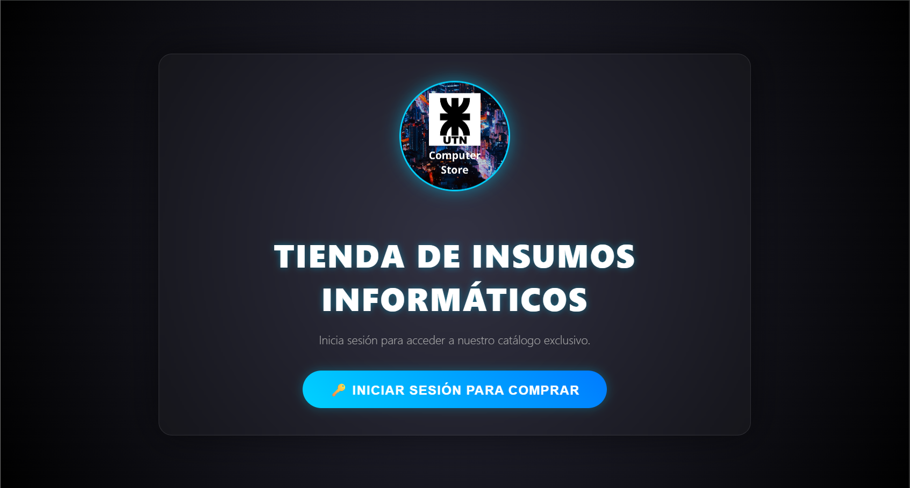
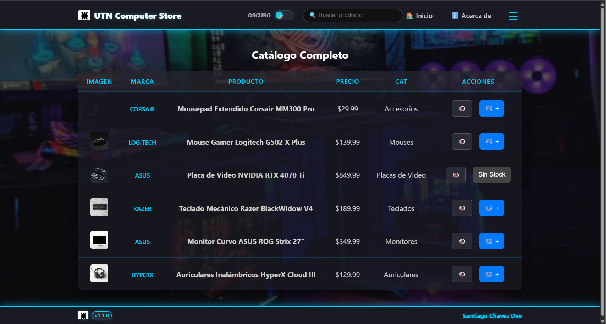
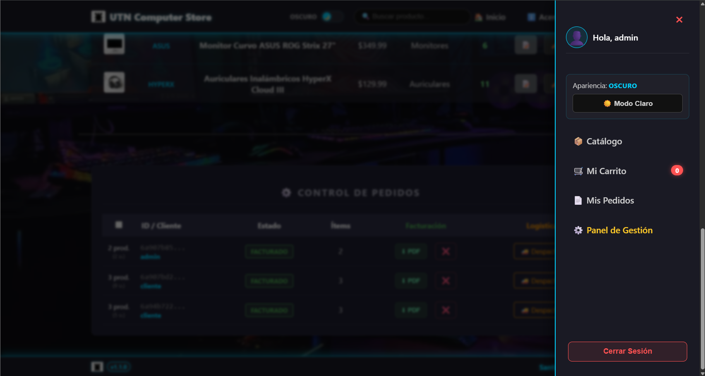
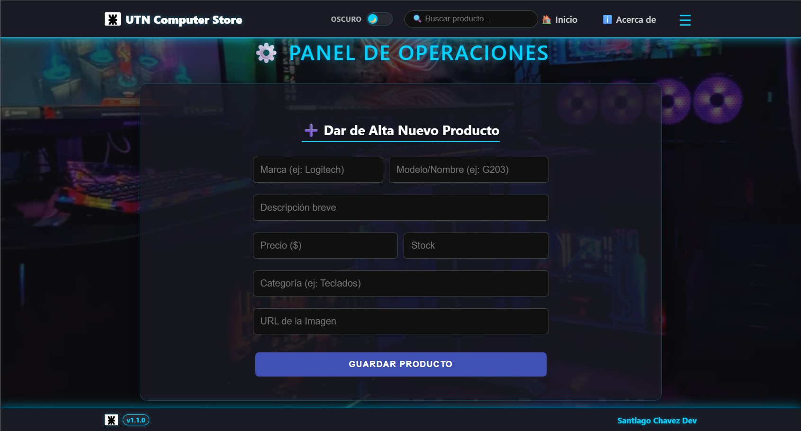
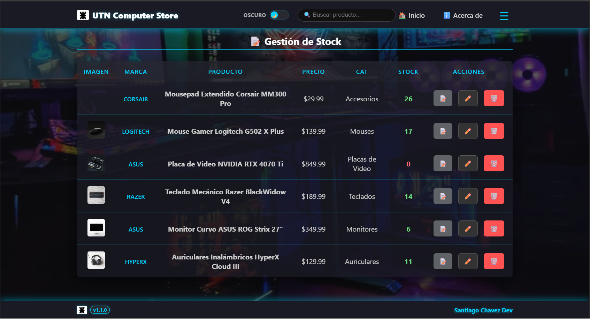
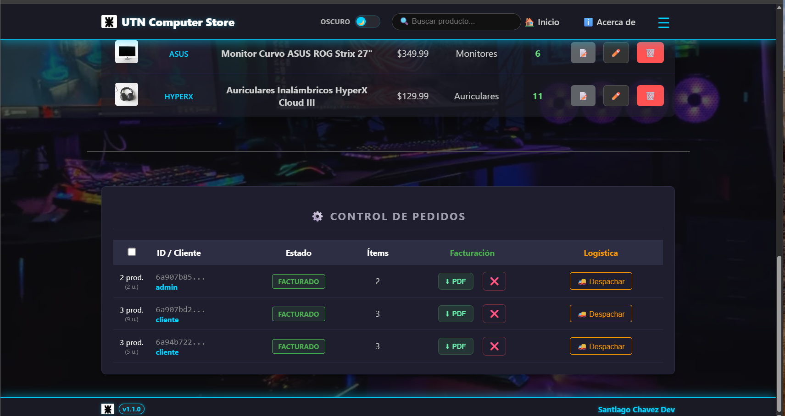
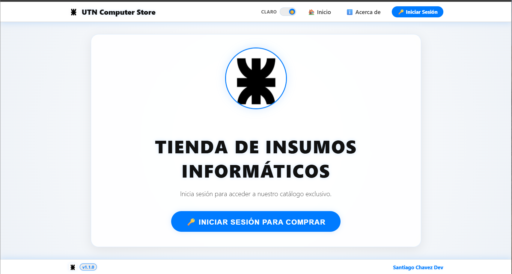
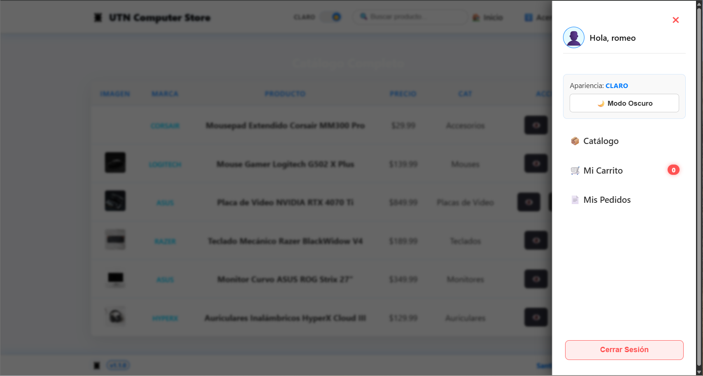

<p align="center">
  
</p>

# Trabajo Integrador Final - E-Commerce Fullstack
### Tienda de Insumos Informáticos - UTN Avellaneda

<p align="center">
  <a href="https://ecommerce-gamer-final-utn.vercel.app" target="_blank">
    
  </a>
  <a href="https://ecommerce-gamer-final-utn.onrender.com/api/productos" target="_blank">
    
  </a>
  
  
</p>

Este proyecto es una aplicación web Fullstack de E-commerce diseñada para una Tienda de Insumos Informáticos. Ofrece una solución integral que abarca desde el catálogo público y carrito de compras para clientes, hasta un panel de administración avanzado (Backoffice) con gestión de stock en tiempo real, control de pedidos, facturación en PDF y logística de despacho.

Este software fue desarrollado y presentado como el **Trabajo Integrador Final** para aprobar la cursada de la **Tecnicatura Universitaria en Programación** en la **Universidad Tecnológica Nacional (UTN) Facultad Regional Avellaneda**.

---

## 👤 Información del Autor y Académica

* **Autor:** Chavez Santiago Ezequiel
* **Institución:** Universidad Tecnológica Nacional (UTN) - Facultad Regional Avellaneda
* **Carrera:** Tecnicatura Universitaria en Programación
* **Propósito:** Trabajo Integrador Final de Cátedra
* **Versión:** `v1.2.0` (Septiembre 2026)

---

## 🌐 Enlaces de Acceso y Demo en Vivo (Cloud Deploy)

La aplicación se encuentra 100% desplegada y operativa en la nube para acceso público sin requerir instalaciones:

* 🛍️ **Frontend de la Tienda (React SPA):** [https://ecommerce-gamer-final-utn.vercel.app](https://ecommerce-gamer-final-utn.vercel.app)
* 🔌 **Backend API REST (Spring Boot):** [https://ecommerce-gamer-final-utn.onrender.com/api/productos](https://ecommerce-gamer-final-utn.onrender.com/api/productos)
* 📑 **Guía Técnica de Docker en PDF:** [`Guia_Docker_Ecommerce_Gamer_UTN.pdf`](Guia_Docker_Ecommerce_Gamer_UTN.pdf)
* 📊 **Informe Arquitectura Docker vs JobFlow en PDF:** [`Informe_Arquitectura_Docker_vs_JobFlow_UTN.pdf`](Informe_Arquitectura_Docker_vs_JobFlow_UTN.pdf)

---

## 🛠️ Tecnologías Utilizadas

### Backend (API REST)
*  **Java 17/21**: Lenguaje de programación base.
*  **Spring Boot 3.x**: Framework principal para backend y arquitectura REST.
*  **Spring Data MongoDB**: Mapeo y persistencia de documentos NoSQL.
*  **MongoDB Atlas**: Cluster NoSQL distribuido y persistente en la nube.
*  **Maven**: Gestión de dependencias, testing y ciclo de vida de compilación.

### Frontend (SPA)
*  **React 18**: Librería declarativa para interfaces de usuario reactivas.
*  **Vite**: Servidor de desarrollo ultrarrápido y empaquetador para producción.
*  **React Router v6**: Enrutamiento dinámico SPA y rutas protegidas por roles.
*  **CSS3 Moderno**: Estética "Dark Neon", modo claro, diseño responsivo y micro-animaciones.
* 📄 **jsPDF & AutoTable**: Generación dinámica y descarga instantánea de comprobantes de facturación en PDF.
* 🧪 **Vitest & React Testing Library**: Suite de 13 pruebas unitarias y de integración frontend.

### DevOps, Contenedores e Infraestructura
*  **Docker Multi-Stage**: Contenedores optimizados (`Maven 3.9 + JRE 21 Alpine` para Backend y `Node 20 + Nginx Alpine` para Frontend).
*  **Docker Compose**: Orquestación local y levantamiento sincronizado de todo el stack.
*  **Nginx**: Servidor web HTTP con soporte de enrutamiento SPA (`try_files`) y compresión.
*  **Vercel Edge Network**: Alojamiento del Frontend con CI/CD automático.
*  **Render Cloud**: Despliegue del contenedor Docker del Backend.

---

## 📸 Galería y Recorrido Visual de la Aplicación

A continuación se presentan las principales pantallas, módulos de administración y flujos funcionales de **UTN Computer Store**:

### 1. 🌌 Portada de Acceso y Bienvenida (`Inicio / Autenticación`)

- **Diseño Inmersivo Dark Neon:** Interfaz moderna con efectos de resplandor neón, tipografía estilizada y diseño centrado en el usuario.
- **Acceso Seguro al Catálogo:** Puerta de entrada a la plataforma que guía al usuario a identificarse antes de iniciar su recorrido de compras.
- **Identidad de Marca:** Estética tecnológica personalizada para la tienda de insumos informáticos de UTN Avellaneda.

---

### 2. 🛍️ Catálogo Público y Experiencia de Compra (`Catálogo / Productos`)

- **Exploración de Hardware y Periféricos:** Visualización clara de productos de primeras marcas (Corsair, Logitech, ASUS, Razer, HyperX) con imagen, marca, categoría y precio.
- **Gestión Automatizada de Stock:** Botón interactivo de añadir al carrito habilitado para productos en inventario y badge automático **"Sin Stock"** con bloqueo de compra cuando el stock llega a cero.
- **Búsqueda y Navegación Rápida:** Barra de búsqueda en tiempo real integrada en el encabezado y acceso directo a la vista detallada de cada ítem.

---

### 3. 📱 Menú Lateral y Perfil de Usuario (`Drawer de Navegación`)

- **Gestión de Sesión:** Saludo personalizado al usuario autenticado y opción de cierre de sesión seguro en un solo clic.
- **Navegación Intuitiva:** Enlaces directos a Catálogo, Mis Pedidos y Carrito de Compras con badge reactivo que indica la cantidad de ítems seleccionados en tiempo real.
- **Permisos por Rol:** Acceso condicional exclusivo al **Panel de Gestión** visible únicamente para usuarios con permisos de administrador (`ADMIN`).

---

### 4. ⚙️ Panel de Operaciones - Alta de Productos (`Backoffice / Gestión`)

- **Formulario Integral de Carga:** Alta ágil de nuevos artículos con especificación de marca, modelo, descripción, precio unitario y stock inicial.
- **Clasificación Dinámica:** Asignación inmediata por categorías (Teclados, Mouses, Monitores, Placas de Video, Accesorios) y vinculación de imágenes mediante URL directa.
- **Persistencia en Base de Datos:** Registro instantáneo y sincronizado con MongoDB Atlas mediante la API REST de Spring Boot.

---

### 5. 📊 Gestión Integral de Inventario (`Backoffice / Stock`)

- **Semáforo Visual de Inventario:** Columna de stock destacada con código visual numérico (verde para stock disponible y alerta roja en `0` para productos agotados).
- **Acciones de Mantenimiento:** Herramientas de administración rápida para consultar ficha técnica, modificar parámetros de producto (lápiz) o eliminar ítems (papelera).
- **Consistencia Inmediata:** Cualquier modificación en el inventario impacta en tiempo real sobre la disponibilidad en el catálogo del cliente.

---

### 6. 🚚 Control de Pedidos, Facturación PDF y Logística (`Backoffice / Pedidos`)

- **Trazabilidad Completa de Compras:** Monitoreo cronológico de órdenes con identificador único de compra, usuario comprador y desglose de cantidad de unidades.
- **Facturación Automática con jsPDF:** Emisión y descarga en un clic de la factura formal en PDF con cálculo de subtotales, totales y membrete institucional.
- **Logística y Flujo de Entrega:** Control de estados de pedidos (`FACTURADO`, `PENDIENTE`), botón de despacho (`🚚 Despachar`) y opción de anulación o cancelación de pedidos.

---

### 7. ☀️ Soporte Dual-Theme: Modo Claro (`Light Mode / Accesibilidad`)


- **Conmutación Dinámica (Theme Toggle):** Switch accesible desde el Navbar y desde el menú lateral para alternar al instante entre Modo Oscuro y Modo Claro.
- **Adaptación Visual Limpia:** Paleta cromática optimizada para entornos luminosos con fondos claros, manteniendo el contraste y la jerarquía de lectura.
- **Persistencia de Preferencia:** La elección del tema se preserva de manera global y reactiva a través del `ThemeContext`.

---

## 🚀 Métodos de Instalación y Ejecución Local

Si deseas correr el proyecto en tu propia computadora, dispones de 3 modalidades:

### Opción 1: 🐳 Arranque con Docker Compose (Recomendado / Multiplataforma)
Si tienes [Docker Desktop](https://www.docker.com/products/docker-desktop/) instalado y abierto:

1. Abre una terminal en la raíz del proyecto y ejecuta:
   ```bash
   docker compose up --build
   ```
2. Una vez levantados los contenedores, abre:
   * **Frontend:** [http://localhost:5176](http://localhost:5176)
   * **Backend API:** [http://localhost:8080/api/productos](http://localhost:8080/api/productos)

Para detener los contenedores:
```bash
docker compose down
```

---

### Opción 2: ⚡ Arranque Rápido con Script (Nativo en Windows)
Si tienes Java 17+ y Node.js configurados en Windows:

1. Haz doble clic sobre [`lanzarProyecto.vbs`](lanzarProyecto.vbs) o ejecuta [`start_proyecto.bat`](start_proyecto.bat).
2. Se iniciará el backend, el frontend y se abrirá automáticamente el navegador en `http://localhost:5176`.

---

### Opción 3: 🛠️ Método Manual (Paso a Paso)

#### Paso 1: Configurar y arrancar el Backend
1. Abre una terminal en `/backend`.
2. Compila y ejecuta con Maven:
   ```bash
   mvn spring-boot:run
   ```
   *(Backend escuchando en `http://localhost:8080`)*

#### Paso 2: Configurar y arrancar el Frontend
1. Abre otra terminal en `/frontend`.
2. Instala dependencias y arranca el servidor de desarrollo:
   ```bash
   npm install
   npm run dev
   ```
   *(Frontend disponible en `http://localhost:5176`)*

#### Paso 3: Ejecutar la Suite de Pruebas Unitarias (Vitest)
```bash
npm run test
```
*(Ejecuta las 13 pruebas automatizadas de Vitest con JSDOM).*

---

## 🔑 Usuarios de Prueba (Generados Automáticamente)

Al iniciar el backend por primera vez, el sistema crea automáticamente estos usuarios de prueba en MongoDB Atlas:

| Usuario | Contraseña | Rol / Permisos | Acceso Permitido |
| :--- | :--- | :--- | :--- |
| **admin** | `1234` | `ADMIN` | Catálogo de compra + Acceso exclusivo al Panel de Gestión (`/gestion`) |
| **cliente** | `1234` | `USER` | Catálogo, añadir al carrito, realizar compras e historial de pedidos |

---

## 🐛 Registro de Errores Resueltos y Solución de Problemas (Troubleshooting & Bug Fixes)

Durante el ciclo de desarrollo, contenedorización y despliegue del proyecto se identificaron y resolvieron los siguientes desafíos técnicos:

### 1. `docker: command not found` en terminales de Windows
* **Causa:** Al instalar Docker Desktop mientras una terminal (Git Bash o PowerShell) ya estaba abierta, la sesión conservaba la variable `PATH` antigua del sistema operativo.
* **Solución:** Cargar la ruta en la sesión activa con `export PATH="$PATH:/c/Users/Santiago/AppData/Local/Programs/DockerDesktop/resources/bin"` o reiniciar la terminal del IDE.

### 2. Error 404 al recargar rutas de React Router en Producción (Nginx)
* **Causa:** En aplicaciones SPA (Single Page Applications), al refrescar rutas como `/gestion` o `/pedidos`, los servidores web tradicionales buscan un archivo físico en el disco que no existe.
* **Solución:** Se configuró en `frontend/nginx.conf` la directiva `try_files $uri $uri/ /index.html;`, permitiendo que Nginx redirija las peticiones a `index.html` para que React Router resuelva la navegación en el cliente.

### 3. Error de CORS en peticiones Frontend (Vercel) ➔ Backend (Render)
* **Causa:** El navegador bloqueaba las peticiones cruzadas originadas desde dominios de Vercel (`*.vercel.app`) hacia la API de Spring Boot por políticas de origen cruzado estrictas.
* **Solución:** Se parametrizó `WebConfig.java` utilizando `.allowedOriginPatterns(...)` con soporte dinámico para `https://*.vercel.app`, `https://*.onrender.com` y `http://localhost:*`.

### 4. Cold Start (Arranque en frío) en el Plan Free de Render
* **Causa:** El plan gratuito de Render suspende los servicios web tras 15 minutos de inactividad para ahorrar recursos.
* **Solución:** La primera petición puede tardar entre 30 y 50 segundos mientras el contenedor se reactiva. Una vez despierto, la respuesta es inmediata.

### 5. Control de Stock Concurrente y Validación de Cantidades
* **Causa:** Posibilidad de que un usuario intente comprar un artículo agotado o una cantidad superior al inventario disponible.
* **Solución:** Implementación de la excepción `StockInsuficienteException` en el Backend con retorno de código `HTTP 409 Conflict`, sincronizada con bloqueo visual del botón en Frontend y badge "Sin Stock".

### 6. Warnings de Tipos Nulos en Spring Boot (`Null Type Safety`)
* **Causa:** Advertencias del compilador de Java 21 sobre posibles referencias nulas en repositorios y configuraciones de Spring.
* **Solución:** Uso explícito de la anotación `@SuppressWarnings("null")` en controladores, servicios y clases de configuración.

---

## 📂 Estructura del Proyecto

```text
ecommerce-gamer/
│
├── docker-compose.yml                    # Orquestación de contenedores Docker
├── Guia_Docker_Ecommerce_Gamer_UTN.pdf   # Guía técnica de Docker y Docker Compose
├── Informe_Arquitectura_Docker_vs_JobFlow_UTN.pdf  # Informe comparativo de despliegues
│
├── backend/                              # Servidor Spring Boot (Java 21)
│   ├── Dockerfile                        # Multi-stage build (Maven 3.9 + JRE 21 Alpine)
│   ├── .dockerignore                     # Exclusiones para build de Docker
│   ├── pom.xml                           # Dependencias Maven y plugins
│   ├── src/main/java/com/entregaFinal/gestion/
│   │   ├── controller/                   # Endpoints REST (Auth, Pedidos, Productos)
│   │   ├── model/                        # Entidades y documentos de MongoDB
│   │   ├── repository/                   # Interfaces Spring Data MongoDB
│   │   ├── service/                      # Lógica de negocio (Gestión de stock, validaciones)
│   │   ├── exception/                    # Manejo de excepciones (StockInsuficienteException)
│   │   ├── config/                       # Configuración (CORS dinámico, DataInitializer)
│   │   └── PreentregaJavaGestionApplication.java  # Clase principal
│   └── src/main/resources/
│       └── application.properties        # Variables de entorno y conexión a Atlas
│
├── frontend/                             # Cliente React (SPA con Vite)
│   ├── Dockerfile                        # Multi-stage build (Node 20 + Nginx Alpine)
│   ├── nginx.conf                        # Configuración de Nginx para SPA
│   ├── .dockerignore                     # Exclusiones para build de Docker
│   ├── src/
│   │   ├── components/                   # Componentes modulares (Navbar, Footer, Modales)
│   │   ├── views/                        # Páginas completas (Inicio, Carrito, Gestión, etc.)
│   │   ├── context/                      # Contextos globales (ThemeContext, NotificationContext)
│   │   ├── config/                       # Configuración de API desacoplada (api.js)
│   │   ├── utils/                        # Generador de Facturas en PDF (jsPDF)
│   │   ├── setupTests.js                 # Configuración de Vitest para JSDOM
│   │   └── App.jsx                       # Configuración de rutas SPA
│   ├── public/                           # Assets estáticos y favicon
│   └── package.json                      # Scripts y dependencias
│
├── lanzarProyecto.vbs                    # Lanzador para Windows (sin consolas visibles)
├── start_proyecto.bat                    # Script batch de arranque ordenado
└── README.md                             # Documentación principal del proyecto
```

---

## 📈 Historial de Cambios (Changelog)

El registro cronológico de las versiones, mejoras de arquitectura y nuevas funcionalidades se encuentra detallado en el archivo [changelog.md](changelog.md).
